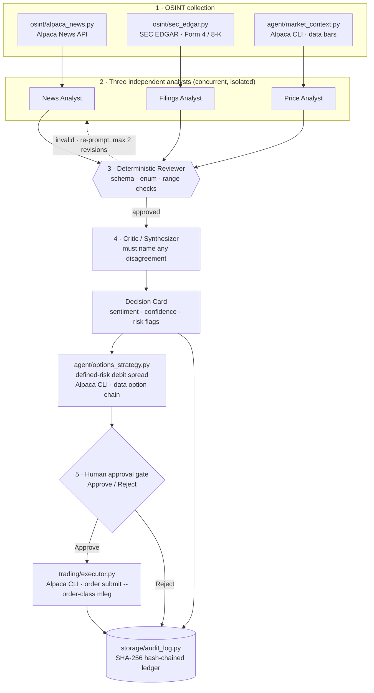
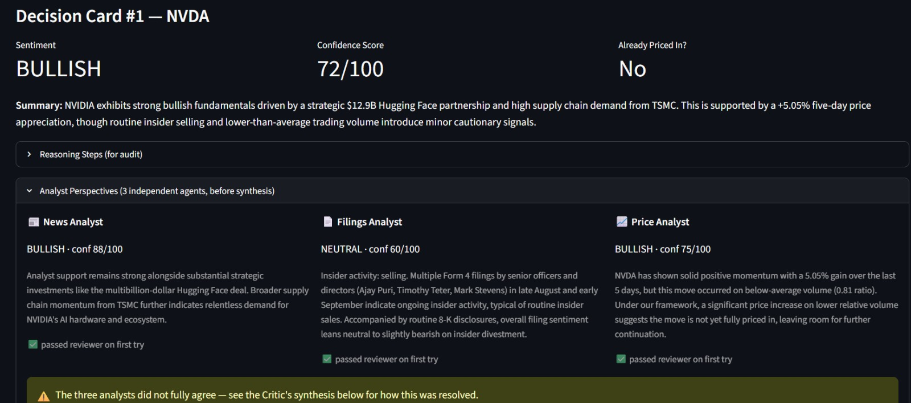
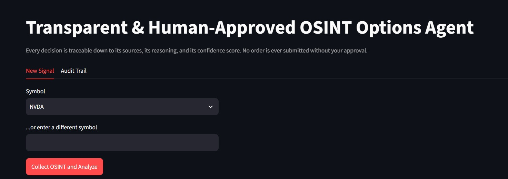
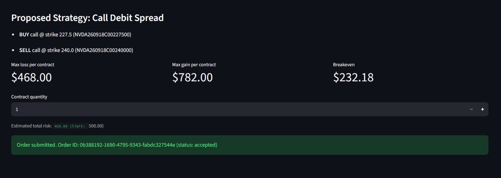
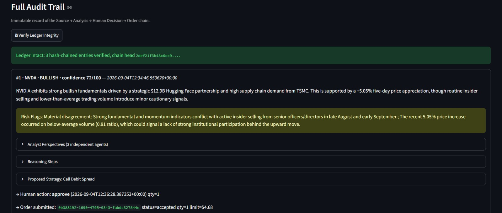

<h1 align="center">ClearSpread</h1>

<p align="center">
  <b>A transparent, human-approved OSINT options agent.</b><br/>
  Three independent analysts argue, a critic reconciles them,<br/>
  and a human clicks the only button that can touch the market.
</p>

<p align="center">
  Built for the <a href="https://lablab.ai/">Alpaca AI Trading Agents Hackathon</a> — <i>Options Alpha Agents</i> track.
</p>

---

## Idea

Most entries build "pull a headline → let the agent interpret it → auto-trade" pipelines.
ClearSpread deliberately stands somewhere else: **auditability over speed**.

- **Three independent analyst agents** (News, SEC Filings, Price/Momentum) each judge the
  same symbol from only their own slice of the data — they never see each other's output.
  A **Critic agent** then synthesizes their opinions into one **Decision Card** and is
  required to explicitly call out any disagreement (e.g. bullish news vs. insiders selling)
  as a risk flag, instead of silently averaging it away.
- **Every agent's output passes a deterministic Reviewer** before it is accepted — schema,
  enum and range checks, not a second opinion. Invalid output is re-prompted with the exact
  validation errors (up to 2 revisions) before the pipeline fails loudly. This is
  intentionally *not* a second LLM call per node: doubling model traffic would add
  fragility for no benefit on the happy path.
- **The agent never submits an order on its own.** No strategy is executed until a human
  clicks **Approve**.
- **Only defined-risk strategies** are proposed (debit call/put spreads) — max loss is known
  up front. "Naked" option selling is not supported anywhere in the system.
- **Every step** (source → analysis → human decision → order) is written to a **SHA-256
  hash-chained, tamper-evident SQLite ledger**, rendered as a timeline in the Audit Trail
  tab with a one-click integrity check.

## Architecture



| Module | Responsibility |
| --- | --- |
| `osint/alpaca_news.py` | Ticker-scoped headlines via Alpaca's `NewsClient` |
| `osint/sec_edgar.py` | SEC EDGAR full-text search (Form 4 insider trades / 8-K material events) |
| `alpaca_cli.py` | Subprocess wrapper around Alpaca's official CLI |
| `agent/market_context.py` | Recent price/volume for the "already priced in?" check |
| `agent/reasoning.py` | 3 Analyst agents + 1 Critic, forced function-calling, Reviewer loop |
| `agent/options_strategy.py` | Sentiment → defined-risk debit spread from the live option chain |
| `trading/executor.py` | **Only** called post-approval; submits the multi-leg order |
| `storage/audit_log.py` | SQLite history + SHA-256 hash-chained `ledger` table |
| `app.py` | Streamlit UI: analyst panel, Approve/Reject, Audit Trail, ledger verification |

> **Alpaca CLI, not the raw SDK.** The hackathon requires using Alpaca's MCP server or CLI.
> Every market-data and order-execution call in the trading path goes through Alpaca's
> official CLI (`github.com/alpacahq/cli`) via subprocess — account lookup, price bars,
> option chain snapshots and multi-leg order submission. `alpaca-py` is used only in
> `osint/alpaca_news.py` to fetch headlines, which is the OSINT layer, not the trading layer.

---

## 🚀 See ClearSpread in Action

*Experience the full workflow: from raw OSINT collection to human-in-the-loop trade execution and ledger verification.*

|  |  |
| :---: | :---: |
| <b>1. Decision Card & Synthesis</b><br><i>Independent analysts review the asset, while a Critic resolves any conflicting signals.</i> | <b>2. Clean Main Dashboard</b><br><i>Intuitive interface to select a ticker and initiate the reasoning pipeline.</i> |
|  |  |
| <b>3. Defined-Risk Strategy Proposal</b><br><i>Automatically formulated debit spreads with explicit max loss and breakeven metrics.</i> | <b>4. Cryptographic Audit Trail</b><br><i>Immutable, hash-chained ledger ensuring every decision step is transparent and verifiable.</i> |

---

## Setup

### 1. Prerequisites

| Requirement | Notes |
| --- | --- |
| **Python 3.10+** | Developed and tested on 3.12 |
| **Git** | To clone the repository |
| **Alpaca paper trading account** | Options trading **level 3** approval is required for multi-leg debit spreads |
| **Google Gemini API key** | Free tier is enough — see the quota note below |
| **Alpaca CLI** | Official Go binary, installed separately (step 4) |

### 2. Clone and create a virtual environment

```bash
git clone https://github.com/efeer456/ClearSpread.git
cd ClearSpread
```

**macOS / Linux**
```bash
python3 -m venv .venv
source .venv/bin/activate
```

**Windows (PowerShell)**
```powershell
python -m venv .venv
.venv\Scripts\Activate.ps1
```

### 3. Install Python dependencies

```bash
pip install -r requirements.txt
```

### 4. Install the Alpaca CLI

Pick whichever fits your platform:

```bash
# Go toolchain
go install github.com/alpacahq/cli/cmd/alpaca@latest

# Homebrew (macOS / Linux)
brew install alpacahq/tap/cli
```

**Windows:** download the prebuilt binary from
[github.com/alpacahq/cli/releases](https://github.com/alpacahq/cli/releases)
(`cli_x.x.x_windows_amd64.zip`), unzip it, and either put `alpaca.exe` on your `PATH`
or drop it at `bin/alpaca.exe` inside the project and point `ALPACA_CLI_PATH` at it.

Verify the install:

```bash
alpaca version    # tested against 0.0.14
```

### 5. Get your credentials

**Alpaca paper trading keys** — [app.alpaca.markets](https://app.alpaca.markets) →
*Paper Trading* → *API Keys*. Then request **options trading level 3** on that account;
without it, multi-leg orders are rejected. You can confirm your level with:

```bash
alpaca account get
```
and checking that `options_approved_level` is `3`.

**Gemini API key** — [aistudio.google.com/apikey](https://aistudio.google.com/apikey).

**SEC EDGAR** needs no key, but their fair-access policy requires a real contact string
in `SEC_EDGAR_USER_AGENT` (your name / app / email).

### 6. Configure `.env`

```bash
cp .env.example .env
```

Then fill it in:

| Variable | Required | Description |
| --- | --- | --- |
| `ALPACA_API_KEY` | ✅ | Paper trading key |
| `ALPACA_SECRET_KEY` | ✅ | Paper trading secret |
| `GEMINI_API_KEY` | ✅ | Google AI Studio key |
| `SEC_EDGAR_USER_AGENT` | ✅ | Real contact string, e.g. `"Jane Doe ClearSpread jane@example.com"` |
| `ALPACA_CLI_PATH` | — | Defaults to `alpaca`. Use a full path if the binary isn't on `PATH` |
| `GEMINI_MODEL` | — | Defaults to `gemini-3.7-flash` |
| `GEMINI_FALLBACK_MODELS` | — | Comma-separated fallbacks used when a model's daily quota is exhausted |
| `WATCHLIST` | — | Comma-separated tickers shown in the UI dropdown |

> **Gemini quota note.** The free tier counts its daily request quota **per model**, and one
> signal costs 4 agent calls. `GEMINI_FALLBACK_MODELS` exists so a `429` on one model rolls
> over to the next instead of killing the analysis mid-run.

### 7. Run

```bash
streamlit run app.py
```

Open <http://localhost:8501>. The SQLite database (`audit_trail.db`) is created
automatically on first launch and is git-ignored.

### 8. Troubleshooting

| Symptom | Cause / fix |
| --- | --- |
| `alpaca: executable file not found` | The CLI isn't on `PATH` — set `ALPACA_CLI_PATH` to the full binary path |
| Order rejected with a permissions error | The paper account lacks options level 3 |
| `429 RESOURCE_EXHAUSTED` from Gemini | Daily per-model quota is spent; add more ids to `GEMINI_FALLBACK_MODELS` or wait for the reset |
| `503 high demand` from Gemini | Transient — the app already retries automatically |
| Audit Trail is empty after a run | The analysis raised before saving; check the Streamlit console output |
| No filings shown for a ticker | SEC's full-text endpoint intermittently 500s; the app retries 3× then degrades to news + price |

---

## Demo flow (for judges)

1. Start on the **Audit Trail** tab — empty, to show there is no hidden state.
2. Pick a symbol and click **Collect OSINT and Analyze**. Three independent analyst
   opinions appear (News / Filings / Price), each with a reviewer badge.
3. When they disagree, point at the risk flag where the **Critic** names the conflict
   explicitly rather than averaging it away.
4. Review the proposed debit spread — legs, max loss, max gain, breakeven — all computed
   before any approval is possible. Adjust the contract quantity if you like.
5. Click **Approve** to submit the multi-leg order through the Alpaca CLI, or **Reject**
   to log the rejection with zero market impact.
6. Switch to **Audit Trail** and click **🔒 Verify Ledger Integrity** — the hash chain is
   recomputed live from row one and confirmed intact.

## Known limitations (hackathon scope)

- The strategy set is **debit call/put spreads only**. Credit spreads and iron condors are
  a natural next step in `agent/options_strategy.py`.
- SEC EDGAR full-text search matches by company name rather than a proper CIK filter —
  correct in practice for the tickers tested, but a known simplification.
- The pipeline makes 4 model calls per signal (~16–20s observed) rather than 1. That's a
  real latency cost of the multi-agent design, and an acceptable one here: a human is
  about to spend minutes reviewing the card anyway.

## Tech stack

Python · Streamlit · [Alpaca CLI](https://github.com/alpacahq/cli) (market data + paper
trading execution) · `alpaca-py` (OSINT news only) · Google Gemini via `google-genai`
(forced structured function-calling) · SEC EDGAR full-text search · SQLite with a SHA-256
hash-chained ledger.

---

## Team

<!-- ⚠️ FILL IN: replace the placeholders below with the real links before publishing. -->

<table width="100%">
  <tr>
    <td width="50%" align="center">
      <b>Hasan Efe Er</b><br><br>
      <a href="https://github.com/efeer456"></a>
      <a href="LINKEDIN_URL_HERE"></a>
      <a href="mailto:hasanefeer0@gmail.com"></a>
    </td>
    <td width="50%" align="center">
      <b>Berkay Bayramoğlu</b><br><br>
      <a href="https://github.com/Berkaybbayramoglu"></a>
      <a href="https://www.linkedin.com/in/berkaybayramoglu/"></a>
      <a href="mailto:berkaybbayramoglu@gmail.com"></a>
    </td>
  </tr>
</table>
